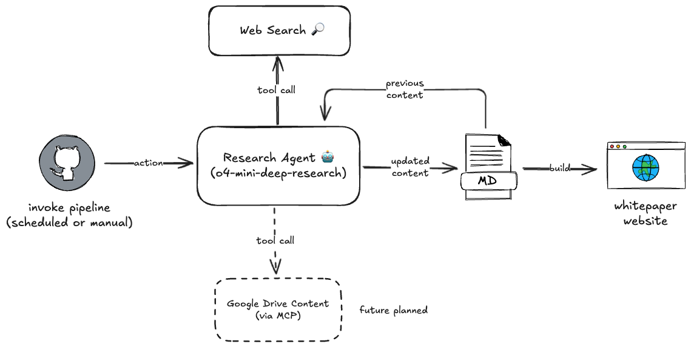
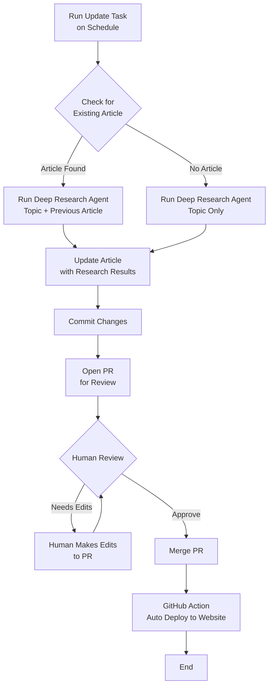

# Living Whitepaper

[](https://github.com/mingnz/livingwp/actions/workflows/run_agent.yml)
[](https://github.com/mingnz/livingwp/actions/workflows/deploy_website.yml)

An open source experiment tracking how generative AI is used across Aotearoa
New Zealand. The repository contains two parts:

- **`src/livingwp`** – the Python code for an LLM agent that gathers research and
  writes updates.
- **`src/website`** – a Jekyll site that is automatically populated with those
  updates and served on GitHub Pages.



## Contributing

We welcome contributions from the community! There are two main ways you can get involved:

- **Open a Pull Request**: If you want to make direct edits to the code or documentation, please fork the repository and open a Pull Request with your changes. This includes updates to the agent logic, website, or any other part of the project.

- **Open an Issue**: If you have suggestions, ideas, or have found a bug, feel free to open an Issue. This is a great way to propose new features, report problems, or discuss improvements.

### Editing the Research Prompt

The prompt that guides the research agent is defined in [`src/livingwp/prompts/instructions_research.md`](https://github.com/mingnz/livingwp/blob/main/src/livingwp/prompts/instructions_research.md). You can suggest changes to this prompt by either:

- Opening a Pull Request directly with your proposed edits to the prompt file.
- Opening an Issue to discuss or suggest changes to the prompt.

We look forward to your contributions!

## Process



## Development

### Requirements

- [uv](https://github.com/astral-sh/uv) for Python dependencies
- Ruby and [Bundler](https://bundler.io) for running the website locally

### Running the Agent

1. Install Python dependencies:

   ```sh
   uv sync
   ```

2. Run the agent:

   ```sh
   uv run livingwp
   ```

Running the command above now iterates over each markdown file in
`src/website/whitepaper/content`, rewriting it with the latest research using
the agent pipeline.

### Working on the Website

1. Change to the site directory:

   ```sh
   cd src/website
   ```

2. Install Ruby gems:

   ```sh
   bundle install
   ```

3. Serve the site locally:

   ```sh
   bundle exec jekyll serve
   ```

The site will be available at `http://localhost:4000` by default.
