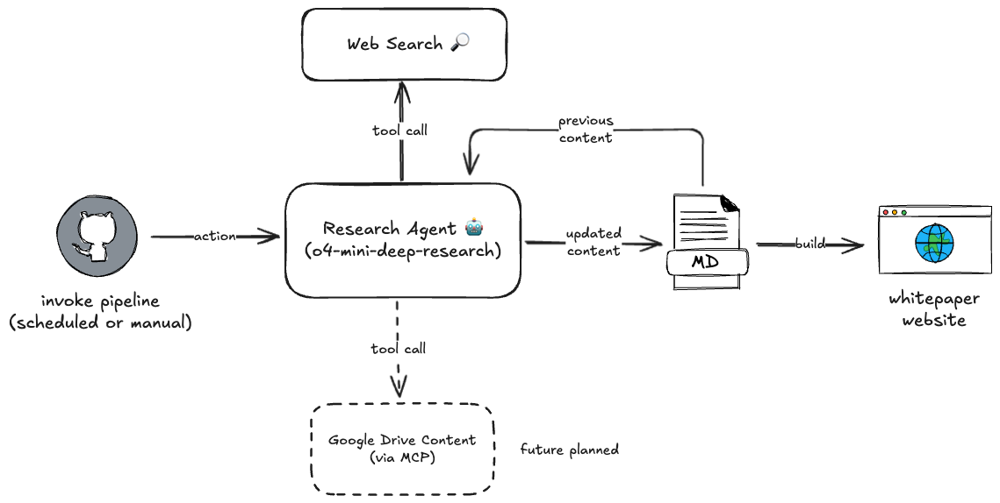
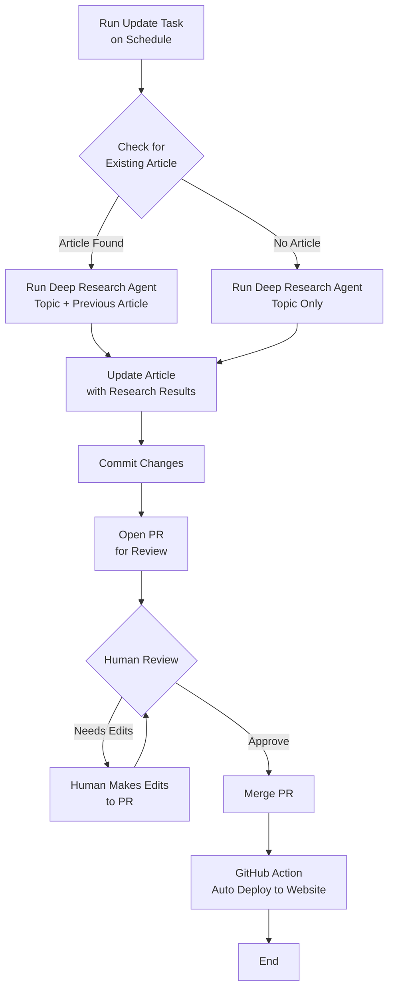

# Living Whitepaper

[](https://github.com/mingnz/livingwp/actions/workflows/run_agent.yml)
[](https://github.com/mingnz/livingwp/actions/workflows/deploy_website.yml)

An open source experiment tracking how generative AI is used across Aotearoa
New Zealand. The site publishes a monthly national "State of AI in New Zealand"
snapshot alongside sector-specific living articles. The repository contains two
parts:

- **`src/livingwp`** – the Python code for an LLM agent that gathers research and
  writes updates.
- **`src/website`** – a Jekyll site that is automatically populated with those
  updates and served on GitHub Pages.



## Contributing

We welcome contributions from the community! There are two main ways you can get involved:

- **Open a Pull Request**: If you want to make direct edits to the code or documentation, please fork the repository and open a Pull Request with your changes. This includes updates to the agent logic, website, or any other part of the project.

- **Open an Issue**: If you have suggestions, ideas, or have found a bug, feel free to open an Issue. This is a great way to propose new features, report problems, or discuss improvements.

### Editing the Research Prompts

The default industry prompt is defined in [`src/livingwp/prompts/instructions_research.md`](https://github.com/mingnz/livingwp/blob/main/src/livingwp/prompts/instructions_research.md).
The New Zealand snapshot uses [`src/livingwp/prompts/instructions_research_nz_snapshot.md`](https://github.com/mingnz/livingwp/blob/main/src/livingwp/prompts/instructions_research_nz_snapshot.md).

You can suggest changes to these prompts by either:

- Opening a Pull Request directly with your proposed edits to the prompt file.
- Opening an Issue to discuss or suggest changes to the prompt.

## Articles, prompts and models

The settings for each generated article are defined in [`src/livingwp/config/industries.json`](https://github.com/mingnz/livingwp/blob/main/src/livingwp/config/industries.json). Changing these settings allows you to:

- Add a new industry article. A new page will be created and added to the site the next time the update process runs.
- Configure special non-industry articles such as the `nz` monthly national snapshot.
- Specify which OpenAI model to use for an article.
- Add a new instructions file to [`src/livingwp/prompts/`](https://github.com/mingnz/livingwp/blob/main/src/livingwp/prompts/) and use it to prompt the research agent for a specific article or industry

The default runtime now uses the `openai-agents` Python SDK on the `0.10.x` line with `gpt-5.4-2026-03-05` as the research model snapshot. You can still override the model with the `RESEARCH_MODEL` environment variable or per-article config.

We look forward to your contributions!

## Process


```mermaid
flowchart TD
    A[Run Update Task<br/>on Schedule] --> B{Check for<br/>Existing Article}

    B -->|Article Found| C1[Run Deep Research Agent<br/>Topic + Previous Article]
    B -->|No Article| C2[Run Deep Research Agent<br/>Topic Only]

    C1 --> D[Update Article<br/>with Research Results]
    C2 --> D

    D --> E[Commit Changes]

    E -->     F[Open PR<br/>for Review]

    F --> G{Human Review}

    G -->|Needs Edits| H[Human Makes Edits<br/>to PR]
    G -->|Approve| I[Merge PR]

    H --> G

    I --> J[GitHub Action<br/>Auto Deploy to Website]

    J --> K[End]
```

## Development

### Requirements

- [uv](https://github.com/astral-sh/uv) for Python dependencies
- Ruby and [Bundler](https://bundler.io) for running the website locally

### Running the Agent

1. Install Python dependencies:

   ```sh
   uv sync
   ```

2. Make sure `OPENAI_API_KEY` is available in your environment before running a
   real update.

3. Run the agent:

   ```sh
   uv run livingwp
   ```

Running the command above iterates over each configured article in
`src/livingwp/config/industries.json`, rewriting the latest page with fresh
research and archiving the outgoing version under
`src/website/whitepaper/content/archive/<slug>/`.

That includes both sector articles such as `healthcare` and the national
snapshot article `nz`.

You can also target specific articles by passing a comma-separated filter. For
example:

```sh
uv run livingwp nz
uv run livingwp finance,healthcare
```

### Working on the Website

1. Change to the site directory:

   ```sh
   cd src/website
   ```

2. Install Ruby gems:

   ```sh
   bundle install
   ```

3. Serve the site locally:

   ```sh
   bundle exec jekyll serve
   ```

The site will be available at `http://localhost:4000` by default.
