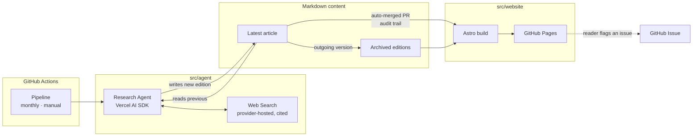
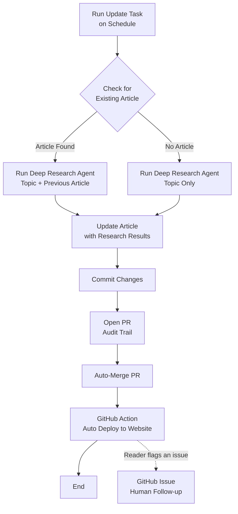

# Living Whitepaper

[](https://github.com/mingnz/livingwp/actions/workflows/run_agent.yml)
[](https://github.com/mingnz/livingwp/actions/workflows/deploy_website.yml)

Living Whitepaper is an open source project that tracks how generative AI is
used across Aotearoa New Zealand. The site publishes a monthly national "State
of AI in New Zealand" snapshot and a set of sector-specific articles. The
pipeline is autonomous: at the start of each month, a GitHub Actions run
researches, rewrites, and publishes every article with no human in the loop.

The repository contains three parts:

- **`src/agent`** – a TypeScript LLM agent that gathers research and writes
  article updates.
- **`src/website`** – an Astro site that renders the articles and deploys to
  GitHub Pages.
- **`packages/article-contract`** – the article frontmatter contract shared by
  the agent and the site, so the two cannot drift.


```mermaid
flowchart LR
    subgraph actions[GitHub Actions]
        trigger[Pipeline<br/>monthly · manual]
    end

    subgraph agent[src/agent]
        research[Research Agent<br/>Vercel AI SDK]
        search[Web Search<br/>provider-hosted, cited]
    end

    subgraph content[Markdown content]
        latest[Latest article]
        archive[Archived editions]
    end

    subgraph website[src/website]
        astro[Astro build]
        pages[GitHub Pages]
    end

    trigger --> research
    research <--> search
    latest -->|reads previous| research
    research -->|writes new edition| latest
    latest -->|outgoing version| archive
    latest -->|auto-merged PR<br/>audit trail| astro
    archive --> astro
    astro --> pages
    pages -.->|reader flags an issue| issue[GitHub Issue]
```

## Autonomous publishing

The `run_agent.yml` workflow runs on a monthly schedule (01:23 UTC on the 1st,
early afternoon on the 1st in Pacific/Auckland). You can also start it manually
from the Actions tab. Each run:

1. Researches and rewrites every configured article.
2. Opens a pull request with the changes and a token-usage report comment.
3. Merges the pull request automatically and triggers the website deploy.

No human approves an update before it goes live. Every run leaves an audit
trail instead: the merged pull request records the content changes, the usage
comment records model and token spend, and the Actions run logs record how the
agent produced its output.

To report a problem in a published article, use the "Flag an issue" link on the
article page, or open an
[article feedback issue](https://github.com/mingnz/livingwp/issues/new?template=article-feedback.yml)
directly. Problems are corrected in a follow-up run or a manual edit.

Manual runs also merge automatically by default. To leave the pull request open
for review, untick the `auto_merge` input when dispatching the workflow.

## Contributing

There are two ways to contribute:

- **Open a pull request.** Fork the repository and open a pull request with
  your changes. This applies to the agent code, the website, and the
  documentation.
- **Open an issue.** Use issues to propose features, report bugs, or discuss
  changes. To report a problem in a published article, use the "Flag an issue"
  link on the article page; it pre-fills the article feedback template.

### Editing the research prompts

The default industry prompt is
[`src/agent/prompts/instructions_research.md`](https://github.com/mingnz/livingwp/blob/main/src/agent/prompts/instructions_research.md).
The New Zealand snapshot uses
[`src/agent/prompts/instructions_research_nz_snapshot.md`](https://github.com/mingnz/livingwp/blob/main/src/agent/prompts/instructions_research_nz_snapshot.md).

To suggest a prompt change, open a pull request with the edit, or open an issue
to discuss it.

## Articles, prompts, and models

Each generated article is configured in
[`src/agent/config/industries.json`](https://github.com/mingnz/livingwp/blob/main/src/agent/config/industries.json).
Through this file you can:

- Add a new industry article. The next update run creates the page and adds it
  to the site.
- Configure special non-industry articles such as the `nz` monthly national
  snapshot.
- Pin an article to a specific model with `research_model`. Bare model names
  use OpenAI; prefix with `anthropic/` or `google/` to use those providers.
  Omit the key to use the default model.
- Pin an article to a specific reasoning effort with
  `research_reasoning_effort`: `minimal`, `low`, `medium`, `high`, `xhigh`, or
  `max`. Omit the key to use the default effort.
- Add an instructions file to
  [`src/agent/prompts/`](https://github.com/mingnz/livingwp/blob/main/src/agent/prompts/)
  and reference it to give a specific article its own prompt.

The agent is built on the [Vercel AI SDK](https://ai-sdk.dev) and works with
any supported provider. The default research model tracks a current frontier
model. It is set by the `RESEARCH_MODEL` environment variable (a repository
variable of the same name in GitHub Actions), with a fallback default in
`src/agent/src/agent.ts`. The agent selects each provider's hosted web-search
tool based on the resolved provider.

Reasoning effort works the same way. The default is `medium`, overridden by the
`RESEARCH_REASONING_EFFORT` environment variable. The scale is shared across
providers and mapped onto each provider's own option: OpenAI's
`reasoningEffort`, Anthropic's `effort`, and Google's `thinkingLevel`. OpenAI
accepts the whole scale. Anthropic has no level below `low`, and Google's tops
out at `high`, so on those providers the ends clamp to the nearest supported
level.

An article's `research_model` and `research_reasoning_effort` take precedence
over the matching environment variable. Articles without the key follow the
environment variable, so one variable change moves every article at once.

## File search

In addition to web search, the agent can incorporate material from a curated
set of articles, papers, and transcripts stored in an OpenAI vector store.

**Update the article config:**

- Create the vector store at
  [platform.openai.com](https://platform.openai.com/storage/vector_stores/).
- Add a `file_store_name` key for the article in
  [`src/agent/config/industries.json`](https://github.com/mingnz/livingwp/blob/main/src/agent/config/industries.json).
  File search uses OpenAI vector stores, so the article's `research_model` must
  be an OpenAI model.
- To let the agent cite files that are publicly available, add `filename_urls`
  to the configuration. The agent uses these to include citation links for
  referenced files.

Example:

```json
   "file_store_name": "finance_files",
   "filename_urls": {
        "2504.20086v1.pdf": {"title":"Understanding and Mitigating Risks of Generative AI", "url": "https://arxiv.org/pdf/2504.20086v1"},
        "BloombergGPT.pdf": {"title":"BloombergGPT", "url": "https://arxiv.org/pdf/2303.17564"},
        "Large Language Models in Finance.pdf": {"title":"Large Language Models in Finance", "url": "https://arxiv.org/pdf/2311.10723"}
    }
```

**Update the instructions:**

The configuration gives the agent access to the tools, but the article's
instructions file must also tell the agent how to use them. Example:

```md
# Gather Information
- ...
- Use the file search tool to perform an extensive review of all of the available curated articles, papers and transcripts.

# Output Format
- ...
- For file search results, include a markdown link for every factual claim from a private file. Use the filename_to_link_converter tool to provide the link for each file. Do not include placeholders for file links if the tool doesn't return one. Enclose each file link in parentheses e.g. (markdown_link). Include links for files after any web search links for the same paragraph.
- Ensure all markdown hyperlinks in the final output are correctly formatted
```

## Process


```mermaid
flowchart TD
    A[Run Update Task<br/>on Schedule] --> B{Check for<br/>Existing Article}

    B -->|Article Found| C1[Run Deep Research Agent<br/>Topic + Previous Article]
    B -->|No Article| C2[Run Deep Research Agent<br/>Topic Only]

    C1 --> D[Update Article<br/>with Research Results]
    C2 --> D

    D --> E[Commit Changes]

    E --> F[Open PR<br/>Audit Trail]

    F --> G[Auto-Merge PR]

    G --> H[GitHub Action<br/>Auto Deploy to Website]

    H --> I[End]

    H -.->|Reader flags an issue| J[GitHub Issue<br/>Human Follow-up]
```

## Development

### Requirements

- [Node.js](https://nodejs.org) 22+

The repo is an npm-workspaces monorepo (`src/agent`, `src/website`,
`packages/article-contract`). Install everything once from the root:

```sh
npm install
```

### Running the agent

1. Make sure the API key for your configured provider is available in your
   environment: `OPENAI_API_KEY` by default, or `ANTHROPIC_API_KEY` or
   `GOOGLE_GENERATIVE_AI_API_KEY` for those providers. See
   [`.env.sample`](.env.sample).

2. Run the agent from the repo root:

   ```sh
   npm run agent
   ```

This iterates over each configured article in
`src/agent/config/industries.json`, rewrites the latest page with fresh
research, and archives the outgoing version under
`src/website/whitepaper/content/archive/<slug>/`. It covers both sector
articles such as `healthcare` and the national snapshot article `nz`.

To target specific articles, pass a comma-separated filter:

```sh
npm run agent -- nz
npm run agent -- finance,healthcare
```

### Working on the website

Serve the site locally from the repo root:

```sh
npm run dev:site
```

The site is available at `http://localhost:4321` by default.
