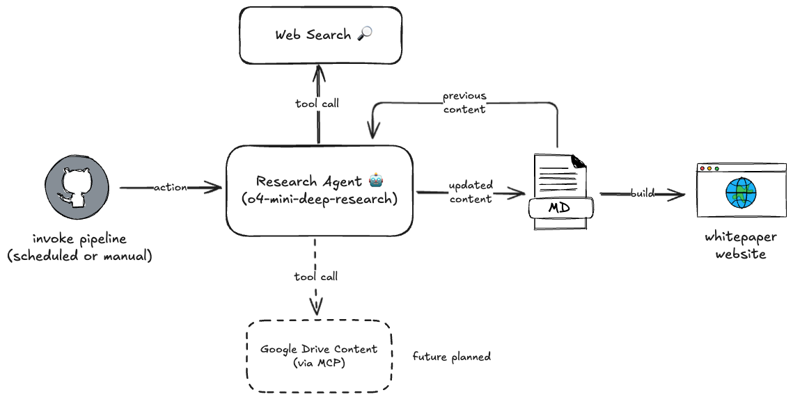
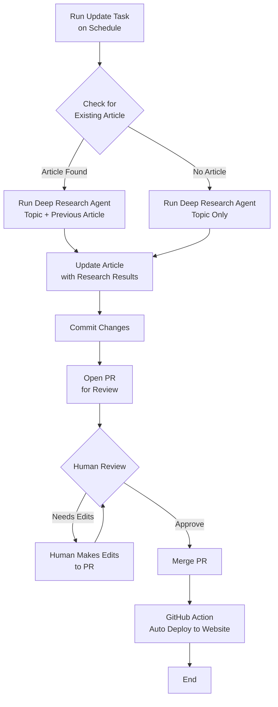

# Living Whitepaper

[](https://github.com/mingnz/livingwp/actions/workflows/run_agent.yml)
[](https://github.com/mingnz/livingwp/actions/workflows/deploy_website.yml)

An open source experiment tracking how generative AI is used across Aotearoa
New Zealand. The site publishes a monthly national "State of AI in New Zealand"
snapshot alongside sector-specific living articles. The repository contains two
parts:

- **`src/agent`** – the TypeScript code for an LLM agent that gathers research and
  writes updates.
- **`src/website`** – an Astro site that is automatically populated with those
  updates and served on GitHub Pages.
- **`packages/article-contract`** – the shared article frontmatter contract used
  by both, so the agent and site can't drift.



## Contributing

We welcome contributions from the community! There are two main ways you can get involved:

- **Open a Pull Request**: If you want to make direct edits to the code or documentation, please fork the repository and open a Pull Request with your changes. This includes updates to the agent logic, website, or any other part of the project.

- **Open an Issue**: If you have suggestions, ideas, or have found a bug, feel free to open an Issue. This is a great way to propose new features, report problems, or discuss improvements.

### Editing the Research Prompts

The default industry prompt is defined in [`src/agent/prompts/instructions_research.md`](https://github.com/mingnz/livingwp/blob/main/src/agent/prompts/instructions_research.md).
The New Zealand snapshot uses [`src/agent/prompts/instructions_research_nz_snapshot.md`](https://github.com/mingnz/livingwp/blob/main/src/agent/prompts/instructions_research_nz_snapshot.md).

You can suggest changes to these prompts by either:

- Opening a Pull Request directly with your proposed edits to the prompt file.
- Opening an Issue to discuss or suggest changes to the prompt.

## Articles, prompts and models

The settings for each generated article are defined in [`src/agent/config/industries.json`](https://github.com/mingnz/livingwp/blob/main/src/agent/config/industries.json). Changing these settings allows you to:

- Add a new industry article. A new page will be created and added to the site the next time the update process runs.
- Configure special non-industry articles such as the `nz` monthly national snapshot.
- Pin one article to a specific model via `research_model`. Bare names (e.g. `gpt-5.4-2026-03-05`) use OpenAI; prefix with `anthropic/` or `google/` to use those providers. Leave the key out to use the default model for every article.
- Add a new instructions file to [`src/agent/prompts/`](https://github.com/mingnz/livingwp/blob/main/src/agent/prompts/) and use it to prompt the research agent for a specific article or industry.

The agent is built on the [Vercel AI SDK](https://ai-sdk.dev), so it works with any supported provider. The default research model is `gpt-5.4-2026-03-05` (OpenAI), overridden by the `RESEARCH_MODEL` environment variable (a repository variable of that name in GitHub Actions). Each provider's hosted web-search tool is used automatically based on the resolved provider.

An article's `research_model` takes precedence over `RESEARCH_MODEL`. Articles with no `research_model` key follow the environment variable, so a single variable change moves every article to a new model.

We look forward to your contributions!

## File search

In addition to web search results, the agent can be prompted to incorporate material from your collated articles, papers and transcripts:

**Update the article config** 

- Create the vector store in [platform.openai.com](https://platform.openai.com/storage/vector_stores/). 
- Add a `file_store_name` key for the article in [`src/agent/config/industries.json`](https://github.com/mingnz/livingwp/blob/main/src/agent/config/industries.json). File search uses OpenAI vector stores, so the article's `research_model` must be an OpenAI model.
- Where they're available, you can also provide public URLs for any files in the store by adding `filename_urls` to the configuration. This will allow the agent to include citation links for any referenced files.

E.g.

```json
   "file_store_name": "finance_files",
   "filename_urls": {        
        "2504.20086v1.pdf": {"title":"Understanding and Mitigating Risks of Generative AI", "url": "https://arxiv.org/pdf/2504.20086v1"},
        "BloombergGPT.pdf": {"title":"BloombergGPT", "url": "https://arxiv.org/pdf/2303.17564"},
        "Large Language Models in Finance.pdf": {"title":"Large Language Models in Finance", "url": "https://arxiv.org/pdf/2311.10723"}
    }
```

**Update the instructions:** 

- The configuration changes will give the agent access to the required tools but you'll also need to provide specific instructions on how to use them

E.g. 

```md
# Gather Information
- ...
- Use the file search tool to perform an extensive review of all of the available curated articles, papers and transcripts.
    
# Output Format
- ...
- For file search results, include a markdown link for every factual claim from a private file. Use the filename_to_link_converter tool to provide the link for each file. Do not include placeholders for file links if the tool doesn't return one. Enclose each file link in parentheses e.g. (markdown_link). Include links for files after any web search links for the same paragraph.
- Ensure all markdown hyperlinks in the final output are correctly formatted
    
```


## Process


```mermaid
flowchart TD
    A[Run Update Task<br/>on Schedule] --> B{Check for<br/>Existing Article}

    B -->|Article Found| C1[Run Deep Research Agent<br/>Topic + Previous Article]
    B -->|No Article| C2[Run Deep Research Agent<br/>Topic Only]

    C1 --> D[Update Article<br/>with Research Results]
    C2 --> D

    D --> E[Commit Changes]

    E -->     F[Open PR<br/>for Review]

    F --> G{Human Review}

    G -->|Needs Edits| H[Human Makes Edits<br/>to PR]
    G -->|Approve| I[Merge PR]

    H --> G

    I --> J[GitHub Action<br/>Auto Deploy to Website]

    J --> K[End]
```

## Development

### Requirements

- [Node.js](https://nodejs.org) 22+

The repo is an npm-workspaces monorepo (`src/agent`, `src/website`,
`packages/article-contract`). Install everything once from the root:

```sh
npm install
```

### Running the Agent

1. Make sure the API key for your configured provider is available in your
   environment (`OPENAI_API_KEY` by default; `ANTHROPIC_API_KEY` or
   `GOOGLE_GENERATIVE_AI_API_KEY` if you use those providers). See
   [`.env.sample`](.env.sample).

2. Run the agent from the repo root:

   ```sh
   npm run agent
   ```

This iterates over each configured article in
`src/agent/config/industries.json`, rewriting the latest page with fresh
research and archiving the outgoing version under
`src/website/whitepaper/content/archive/<slug>/`.

That includes both sector articles such as `healthcare` and the national
snapshot article `nz`.

You can also target specific articles by passing a comma-separated filter. For
example:

```sh
npm run agent -- nz
npm run agent -- finance,healthcare
```

### Working on the Website

Serve the site locally from the repo root:

```sh
npm run dev:site
```

The site will be available at `http://localhost:4321` by default.
