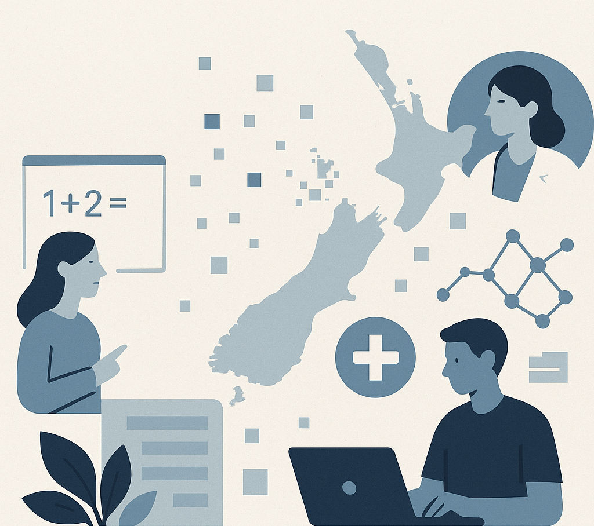



  

Explore how generative AI is shaping Aotearoa New Zealand. This site is a living resource — automatically researched and updated by an AI agent that publishes a monthly national snapshot alongside deeper sector reports.

Want to know what's behind the curtain? [See how it works](how-it-works). This is an open-source project from the AI Forum NZ. Contributions welcome on [GitHub](https://github.com/mingnz/livingwp).
